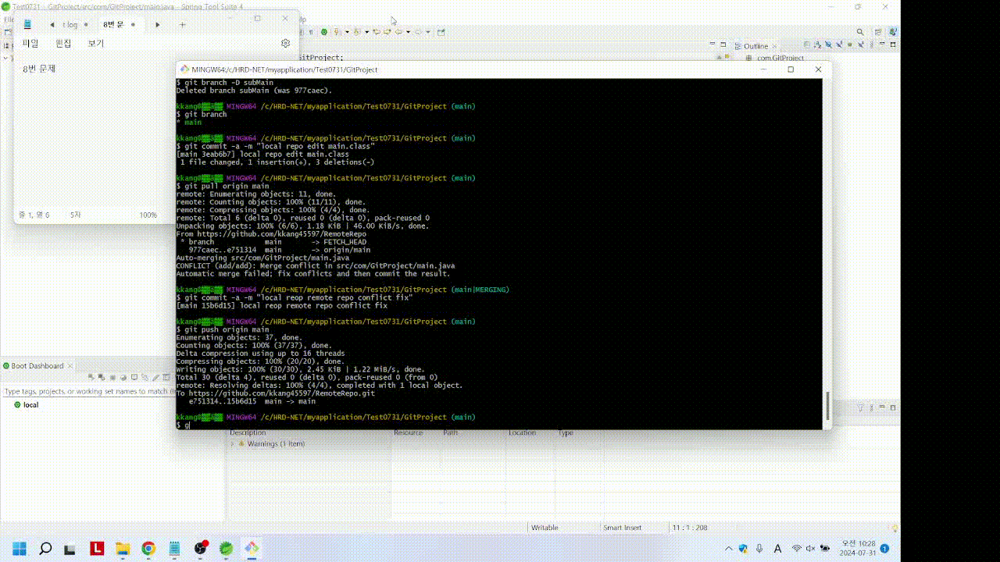
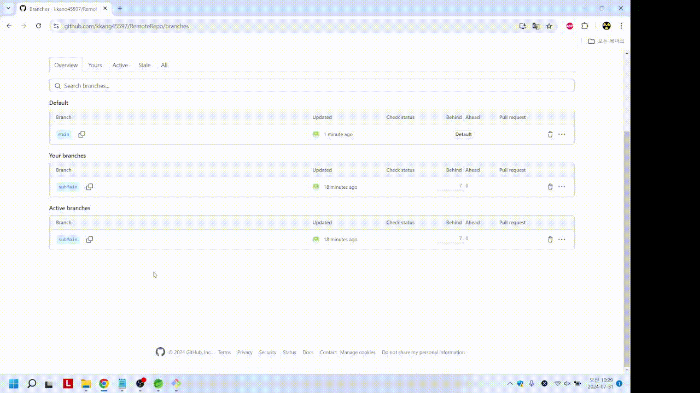

### 문제 01번 : Git Hub에서 비어있는 원격 저장소를 생성하세요.

Git Hub 사이트에서 간단하게 생성이 가능합니다.

### 문제 02번 : git init와 git push 명령어를 실행하세요.

main.class를 생성하고 01번 문제에서 생성한 원격 저장소와 연동합니다.

### 문제 03번 : 로컬 저장소에서 브랜치를 생성하고, 생성한 브랜치를 원격 저장소에 적용하세요

로컬 저장소에서 subMain branch를 생성하고, 생성한 branch를 원격 저장소에 적용합니다.

### 문제 04번 : fast-foward merge를 수행하세요

main branch에서 main.class를 생성하고 subMain2 branch를 생성한 뒤 main.class를 수정하고 fast-forward merge를 적용함

### 문제 05번 : 3-way merge를 수행하고 merge-conflict를 해결하세요.

### 문제 06번 : rebase merge를 수행하고 reabse-conflict를 해결하세요.

### 문제 07번 : 원격 저장소 branch와 로컬 저장소 branch의 충돌을 해결하세요.

### 문제 08번 : 로컬 저장소 branch와 로컬 저장소 branch를 삭제하세요.

### 문제 09번 : amend 옵셥을 사용하여 git undo를 수행하세요.

### 문제 10번 : 팀장은 원격 저장소와 팀원들의 branch를 만들고, pull request를 받아서 main으로 merge한후 팀원의 branch를 삭제하세요. (STS4를 사용하세요)

